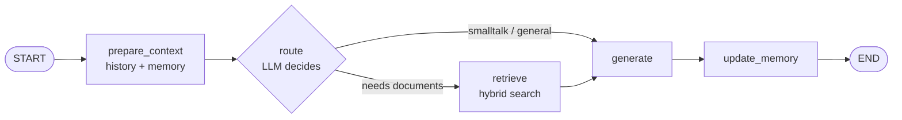
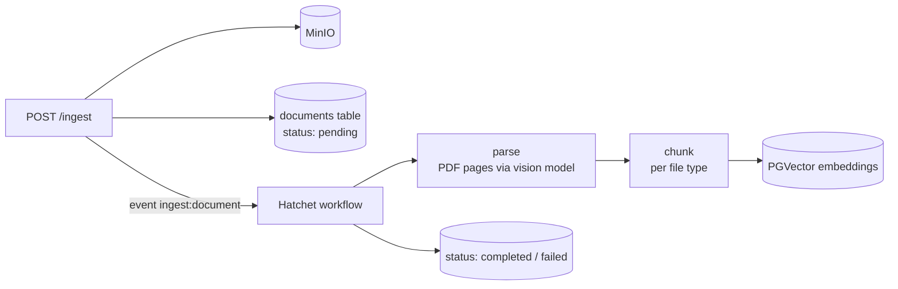

# DRAG — Conversational RAG over your documents

DRAG is a chat API that answers questions about your own documents (PDF, Markdown, text, JSON, HTML). The chat flow is a **LangGraph** state machine with LLM routing, hybrid retrieval and long-term conversation memory. Document ingestion runs as a background **Hatchet** workflow. Everything runs locally with **Ollama** models.

## Architecture

### Chat flow (LangGraph)



- **prepare_context** loads the recent messages and the conversation summary from Postgres.
- **route** asks the LLM, through structured output, whether the question needs the documents. If the model call fails, a simple heuristic decides instead.
- **retrieve** runs hybrid search: pgvector semantic search plus Postgres full-text search (`tsvector`), merged with Reciprocal Rank Fusion.
- **generate** builds the prompt from templates stored in the database and calls the LLM.
- **update_memory** refreshes a running summary of the conversation every few turns.
- Graph state is checkpointed per conversation with `PostgresSaver`, falling back to SQLite.

### Ingestion pipeline



- PDFs are converted to page images and transcribed to Markdown by a vision model, which keeps tables and headings. If that fails, it falls back to `PyPDFLoader`.
- Chunk size and overlap depend on the file type.
- Document status and chunk count are tracked in Postgres.

## Tech stack

| Area | Tools |
|---|---|
| API | Python 3.13, FastAPI, Pydantic, streaming responses |
| Orchestration | LangGraph (StateGraph, conditional edges, checkpointer), LangChain |
| Models | Ollama: `llama3.1` (chat), `llama3.2-vision` (PDF OCR), `nomic-embed-text` (embeddings) |
| Data | PostgreSQL + pgvector, SQLAlchemy 2, Alembic migrations |
| Background jobs | Hatchet (with RabbitMQ) |
| Storage | MinIO (S3-compatible) |
| Infra | Docker, Docker Compose, uv |

## Running locally

Requirements: Docker, and [Ollama](https://ollama.com) running on the host.

```bash
# 1. Pull the models
ollama pull llama3.1
ollama pull llama3.2-vision
ollama pull nomic-embed-text

# 2. Configure the environment
cp .env.example .env

# 3. Start everything (API, worker, Postgres, MinIO, Hatchet, RabbitMQ)
docker compose up --build
```

The API starts on `http://localhost:8000` and the interactive docs are at `http://localhost:8000/docs`. `scripts/start-app.sh` waits for Hatchet and creates the client token automatically.

For a simple chat interface, open `web/index.html` in the browser.

To check that conversation memory works, run the smoke test:

```bash
./scripts/smoke-test.sh
```

## API

| Method | Path | Description |
|---|---|---|
| `POST` | `/chat` | Send a message; creates a conversation when no `conversation_id` is given |
| `POST` | `/chat/stream` | Same as `/chat`, streamed |
| `GET` | `/conversations` | List conversations |
| `POST` | `/conversations` | Create a conversation |
| `GET` | `/conversations/{id}/messages` | Conversation history |
| `POST` | `/ingest` | Upload a document and start ingestion |
| `GET` | `/documents` | List documents and their ingestion status |
| `DELETE` | `/documents/{id}` | Delete a document |
| `GET` / `POST` / `PUT` | `/prompts` | Manage the prompt templates |
| `GET` | `/health` | Health check |

## Project structure

```
app/
  main.py              FastAPI app, startup wiring, checkpointer
  routers/             chat, conversations, documents, prompts, health
  services/
    chat_graph.py      LangGraph chat flow
    retrieval.py       hybrid search + Reciprocal Rank Fusion
    pdf_parser.py      vision-model PDF parsing
    chunking.py        loaders and splitters per file type
    memory.py          conversation summary
  workflows/
    ingestion.py       Hatchet ingestion workflow
  db/                  SQLAlchemy models and session
alembic/               database migrations
prompts.seed.json      default prompt templates
scripts/               container startup and smoke test
web/index.html         minimal chat UI
```

## Notes

- Prompt templates live in the database, so they can be edited through `/prompts` without a redeploy.
- The app is designed to run fully offline with local models. Swapping Ollama for a hosted model only needs a different LangChain chat model in `app/core/rag.py`.
